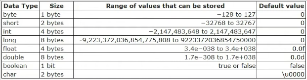

# Tipos primitivos parte 2 - declaração e tamanho em memória

## Tabela dos tipos primitivos


```java
        int age = 20;
        long bigNumber = 100000;
        double doubleSalary = 2000;
        float floatSalary = 2000;
        byte byteAge = 10;
        short shortAge = 20;
        boolean True = true;
        boolean False = false;
        char charGender = 'M';
```

no código acima, na variável byteAge se colocarmos 127, a variável continua sendo válida, porém se colocarmos 128 não, porque o número binário já seria diferente

Tanto é que se tentarmos colocar 128, a IDE IntelliJ nos sugere mudar o tipo para INT

Já no tipo boolean, o tamanho é de apenas 1bit, podendo ser 0 ou 1. Em algumas linguagens é possível atribuir o valor de uma variável 1 para true e 0 para false, porém no Java não é permitido

