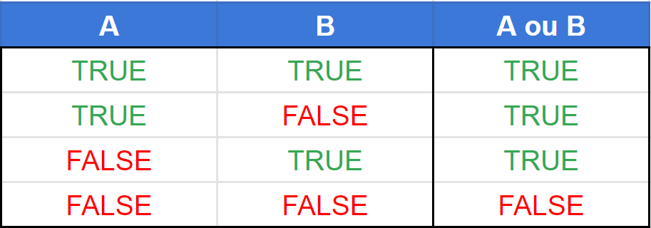

# Operador Lógico || (OR)

## Como funciona o operador lógico ||?
Esse operador basicamente significa OU, então semelhantemente ao operador AND,
ele também compara dois valores, a diferença é que apenas um ou mais valores precisam ser True

Na imagem abaixo fica um pouco mais simples de entender



Caso ainda não tenha entendido, ele funciona assim

```text
resultado = condição1 || condição2
```

Se a condição 1 for verdadeira e a condição 2 for falsa, o resultado é verdadeiro

Se a condição 1 for verdadeira e a condição 2 for verdadeira também, o resultado é verdadeiro

Se a condição 1 for falsa e a condição 2 for verdadeira, o resultado é verdadeiro

Se a condição 1 for falsa e a condição 2 for falsa, o resultado é falso

Como já foi dito acima, ele precisa de uma condição ou mais verdadeira, para retornar um valor True

No código abaixo ficará mais fácil de demonstrar

Vamos utilizar como exemplo uma situação real, e que todos nós já passamos em algum momento da vida (kkkk)
```java
public class Aula18OperadoresLogicosOR {
    public static void main(String[] args) {
        // Vamos fazer uma comparação sobre a função Esqueci minha senha
        boolean temAcessoAoEmail = true;
        boolean temAcessoAoNumDeTelefone = false;

        boolean consegueRecuperarSuaConta = temAcessoAoEmail || temAcessoAoNumDeTelefone;
        System.out.println("O usuário consegue recuperar sua conta? " + consegueRecuperarSuaConta);
    }
}
```
O código acima faz uma comparação para ver se o usuário consegue recuperar a conta dele
Se o usuário tiver acesso ao email, ele consegue, e se ele tiver acesso ao número de telefone
também consegue, portanto, o resultado desse código será...

"O usuário consegue recuperar sua conta? true". Sim, no código acima o usuário consegue recuperar sua conta
Já que ele possui pelo menos um dos itens necessários, que é o acesso ao email

E se o usuário não tiver acesso a nenhum dos dois?
```java
public class Aula18OperadoresLogicosOR {
    public static void main(String[] args) {
        // Vamos fazer uma comparação sobre a função Esqueci minha senha
        boolean temAcessoAoEmail = false;
        boolean temAcessoAoNumDeTelefone = false;

        boolean consegueRecuperarSuaConta = temAcessoAoEmail || temAcessoAoNumDeTelefone;
        System.out.println("O usuário consegue recuperar sua conta? " + consegueRecuperarSuaConta);
    }
}
```
Ao executar o código acima, o resultado impresso será...

"O usuário consegue recuperar sua conta? false". No caso, o usuário não consegue recuperar sua conta, pois ele
não tem acesso nem ao email, e nem ao telefone