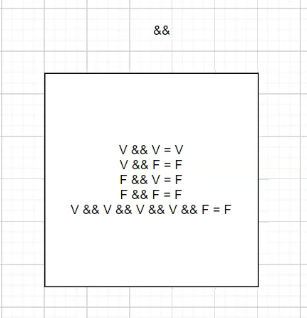
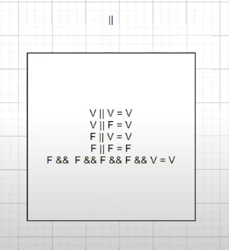

# Estruturas Condicionais Parte 4 - Tabela Verdade

Basicamente está aula não teve código, então irei mostrar as imagens que foram mostradas na aula

## Operador AND (&&)
Na imagem abaixo o professor fala sobre o operador && (AND), e mostra de uma outra forma como funciona.

Resumindo, para o resultado final ser True no operador &&, todos os valores precisam ser True, por isso o nome AND

Basicamente funciona assim. `Se esse valor for true, esse valor for true e esse valor for true. O resultado final é True`

Porém

`Se esse valor for True, esse valor for True e esse valor for False. Ele irá retornar False como resultado final`

## Operador OR (||)
Na imagem abaixo o professor fala sobre o operador || (OR), e mostra de uma outra forma como funciona.

Resumindo, para o resultado final ser True no operador ||, apenas um valor precisa ser True, por isso o nome OR

Basicamente funciona assim. `Se esse valor for False, esse valor for False e esse valor for true. O resultado final é True`

Porém

`Se esse valor for False, esse valor for False e esse valor for False. Ele irá retornar False como resultado final`

