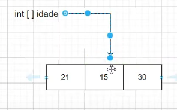

# Arrays parte 1
Primeiramente, um array em Java é considerado um objeto e uma variável de tipo `Reference`, o que significa que podemos inicializar ela atribuindo um valor `null`, 
indicando que eles não fazem referência a nenhum objeto em memória

## Para que ele serve?
Ele serve para simplificar o uso de muitos dados, como assim?. Digamos que nós temos armazenados em memória 3 valores diferentes
```text
idade = 14
idade = 33
idade = 21
```
Se nós quisermos imprimir esses 3 Valores, nós iremos precisar escrever 3 vezes `System.out.println()`, agora imagina isso
com milhares de dados?, é aí que entra o `Array`, através dele nós podemos armazenar valores dentro dele, para em vez de
escrevermos várias variáveis para armazenar vários valores, nós escrever apenas uma linha de código indicando que é um array
e depois vamos adicionando os valores dentro dele

E como fica no código isso?
```java
public class Aula32Arrays {
    public static void main(String[] args) {
        int[] idades;
        System.out.println(idades);
    }
}
```
Porém se tentarmos imprimir o código acima, nós iremos receber um erro indicando que a variável `idades` pode não ter sido
inicializada, para evitar isso nós podemos atribuir o valor `null` a ela, ficando dessa forma, `int[] idades = null`.

Porém até agora nós não estamos fazendo referência a nada, agora vamos referenciar ela a um objeto em memória, já que um 
array é um objeto em memória, para ilustrar melhor tem a imagem abaixo



O `int[] idade` é o nosso Array, e a seta indica que estamos referenciando ela ao nosso objeto, contendo os valores 
21, 15 e 30, que são as nossas idades que iremos trabalhar

E como nós declaramos isso no código?
```java
public class Aula32Arrays {
    public static void main(String[] args) {
        int[] idades = new int[3];
        System.out.println(idades);
    }
}
```
Agora nós criamos o nosso array é determinamos que o tamanho dela é de 3 ( `int[3]`), e estamos fazendo referência
ao nosso objeto em memória que é um Array de 3 posições, porém se tentarmos rodar o código acima, nos será retornado um valor aleatório,
porque nós não indicamos qual valor queremos pegar, então...

## Como nós "pegamos" os nossos valores dentro do array?
Todo valor dentro de um array tem um índice próprio, e uma curiosidade é que em Java e na maioria das linguagens, o índice
comçea pelo 0, isso significa que o nosso Array de 3 posições, para pegarmos o valor `15`, que seria o 2° valor, nós precisamos
chamar o nosso array e indicar que queremos o valor `15` que está na posição `1`, já que os nossos índices começam a partir do `0`,
se quisessemos o valor `21`, nós precisaríamos chamar o Array na posição `0`
```java
public class Aula32Arrays {
    public static void main(String[] args) {
        int[] idades = new int[3];
        System.out.println(idades[0]);
    }
}
```
Ok, no código acima nós já conseguimos pegar o nosso valor que está na primeira posição, que é o índice 0, mas como não
atribuimos valores a essas posições, por padrão o nosso valor é `0`, se todas as vezes que nós criarmos um array e não 
atribuir nenhum valor, por padrão ele terá uma inicialização padrão, se o tipo do array for `int`, o valor padrão será `0`,
se o tipo for `double`, o valor padrão será `0.0` e se for `String` o valor padrão será `null`

E se tentarmos pegar o valor da posição 3, que no nosso caso não existe, já que os nossos índices só vão até a posição 2.

Nós iremos receber um erro dizendo que o índice que indicamos está fora do limite do nosso Array, isso serve tanto para pegarmos, quanto
tentarmos atribuir um valor a um índice que não existe no nosso Array

## E como atribuimos valores?
Basicamente da mesma forma que uma variável normal
```java
public class Aula32Arrays {
    public static void main(String[] args) {
        int[] idades = new int[3];
        idades[0] = 21;
        idades[1] = 15;
        idades[2] = 11;
        System.out.println(idades[0]);
        System.out.println(idades[1]);
        System.out.println(idades[2]);
    }
}
```