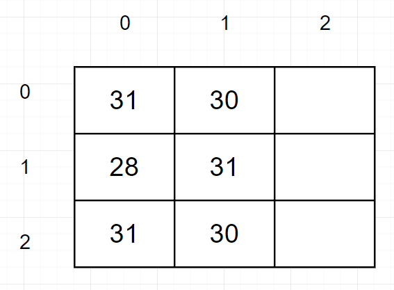

# Arrays Multidimensionais parte 1
Basicamente um Array Multidimensional é um Array de Array, ou seja, são arrays linkados e quando eles estiverem linkados,
nós podemos navegar sobre todas as posições deles

## Como funciona um Array Multidimensional?
Digamos que nós queremos guardar os meses do ano em um array e nós queremos um outro array, onde a quantidade de posições,
seja a quantidade de dias no mês, por exemplo

```text
Nosso primeiro array guardar o número dos meses do ano, por exemplo [1, 2, 3, 4] Meses
E o nosso segundo array vai guardar a quantidade de dias presente nos meses, por exemplo [31, 28, 31, 30] dias
```
no código seria assim.
```java
public class Aula35ArraysMultidimensionais {
    public static void main(String[] args) {
        // 1,2,3 Meses
        // 31,28,31 Dias
        int[][] dias = new int[3][3];
    }
}
```
A quantidade de `[]` colocadas indica quantas dimensões nós temos, no momento vamos trabalhar apenas com duas dimensões

Para exemplificar melhor, digamos que nosso array acima ficou assim



Nós temos um Array, e dentro de cada índice, tem outro Array

## E como acessamos os valores?
Em arrays multidimensionais, nós não conseguimos acessar os valores da forma como vimos antes, que seria
```java
public class Aula35ArraysMultidimensionais {
    public static void main(String[] args) {
        // 1,2,3 Meses
        // 31,28,31 Dias
        int[][] dias = new int[3][];
        
        System.out.println(dias[0]);
    }
}
```
Se tentarmos acessar deste forma, a mensagem que iremos receber é o endereço em memória do outro Array, `[I@65ab7765`.

Então como de fato acessamos?

Apenas indicando que o valor que nós queremos está dentro do primeiro array, que é o índice `0`, e dentro desse primeiro array, digamos que
queremos o segundo valor, que seria o índice `1`

No código ficará assim.
```java
public class Aula35ArraysMultidimensionais {
    public static void main(String[] args) {
        // 1,2,3 Meses
        // 31,28,31 Dias
        int[][] dias = new int[3][];
        
        System.out.println(dias[0][1]);
    }
}
```
Pronto, dessa forma nós acessamos o valor que queríamos, porém se repararmos, não tem nada lá dentro, e oque foi retornado para nós foi
apenas o valor padrão da inicialização de um Array de tipo `int`.

## Como atribuimos valores a Arrays Multidimensionais?
Para atribuir um valor é basicamente da mesma forma que um Array normal, porém seguindo a lógica dos arrays multidimensionais. 
Se num array normal para atribuir um valor nós digitamos `dias[0] = 31`, num Array multidimensional nós faríamos `dias[0][0] = 31`, nesse
caso seria os dias do mês de Janeiro, e `dias[0][1] = 28` para os dias do mês de Fevereiro. No código ficaria assim.

```java
public class Aula35ArraysMultidimensionais {
    public static void main(String[] args) {
        // 1,2,3 Meses
        // 31,28,31 Dias
        int[][] dias = new int[3][3];

        dias[0][0] = 31;
        dias[0][1] = 28;
        dias[0][2] = 31;

        dias[1][0] = 30;
        dias[1][1] = 31;
        dias[1][2] = 30;

        System.out.println(dias[0][1]);
    }
}
```
E para imprimirmos, em vez de escrevermos diversos `sout (System.out.println)`, nós podemos escrever um loop for, desta forma.
```java
public class Aula35ArraysMultidimensionais {
    public static void main(String[] args) {
        // 1,2,3 Meses
        // 31,28,31 Dias
        int[][] dias = new int[3][3];

        dias[0][0] = 31;
        dias[0][1] = 28;
        dias[0][2] = 31;

        dias[1][0] = 30;
        dias[1][1] = 31;
        dias[1][2] = 30;

        for (int i = 0; i < dias.length; i++) {
            System.out.println(dias[i]);
        }
    }
}
```
Porém agora nós temos um problema. Se você executar o código acima, você terá como resposta agora `3` endereços de memória, mas porque?.

Lembra que para acessarmos um array multidimensional ou atribuirmos um valor a ele nós precisamos indicar qual o índice do `Array` e
qual o índice do valor?

Então, com o for não é diferente, nós precisamos também indicar isso, porém agora a lógica e o código mudam um pouco

Para imprimirmos todos os valores do array que se encontra no índice `0`, nós teremos que acessar ele dentro do for, e para
acessarmos é apenas adicionar mais `1` loop `for`, tipo assim.
```text
for (int i = 0; i < dias.length; i++) {
    for (int j = 0; j < dias[0].length; j++) {
        System.out.println(dias[i][j]);
    }
}
```
Agora com a imagem abaixo ficará mais fácil de entender também


```text
O primeiro for vai iniciar com o valor 0 e vai entrar dentro do segundo for

O segundo for também vai iniciar com o valor 0

Agora nós vamos imprimir o nosso array, baseado no código acima digamos que ele está assim

System.out.println(dias[0][0]);

E baseando-se na imagem o valor impresso será 31

Como nós estamos dentro do Array do índice 0, e o tamanho dos nossos Arrays são [3][3], o nosso segundo for será executado novamente

Como o nosso segundo for está sendo executado novamente, nosso código agora está assim

System.out.println(dias[0][1]);

E o valor impresso será 28

Em seguida o for é executado novamente e nosso código fica assim System.out.println(dias[0][2]);

Mostrando o número 31

Ok, agora chegamos no final do primeiro Array, lembra que um array de tamanho [3] tem seus índices 0, 1 e 2?

E a última vez que nosso código foi executado ele estava assim System.out.println(dias[0][2]);. isso significa que chegamos no final do segundo For

Agora o que acontece é que nós iremos voltar ao primeiro For, e a operação i++ será executada, e logo em seguida irá entrar no segundo for novamente

Dessa vez nosso código vai ficar assim. System.out.println(dias[1][0]);

E o valor impresso será 30

Logo em seguida System.out.println(dias[1][1]);

E o valor é 31

E por assim em diante...
```