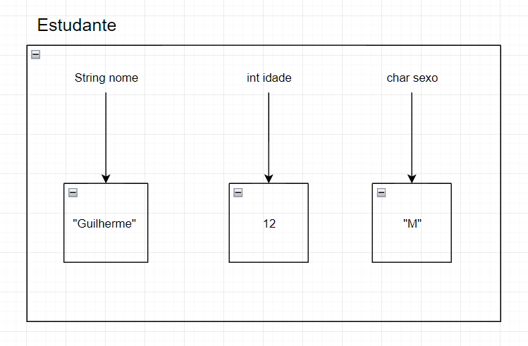
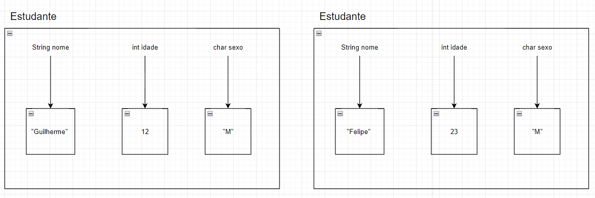
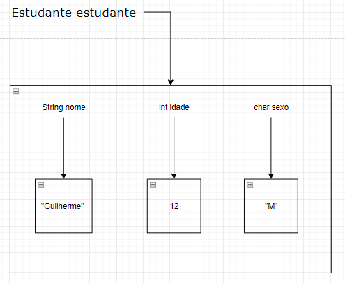
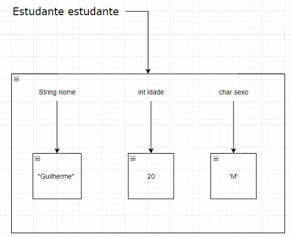

# Orientação a objetos - introdução a classes parte 1
## O que é orientação a objetos?
Até o momento nós estávamos trabalhando com variáveis de tipos primitivos, valores simples, por exemplo.
`int idade = 12` ou  `char sexo = "M"` ou `String name = "Guilherme"`, mas aos poucos as coisas vão começando a 
ficar mais complicadas, e se quisermos guardar esses dados em um espaço em memória?

Se nós pararmos para ver, essas variáveis parecem ser atreladas a pessoas. Porém essas variáveis não tem nenhum vínculo entre si.

A orientação a objetos foi criada para mapear o mundo real e traduzir ele para o mundo computacional, por exemplo, naqueles
dados ali em cima, eles poderiam estar relacionados a um Estudante, onde um estudante possui nome, idade e sexo

E agora esses dados estão agrupados dentro de um objeto, e esse objeto se chama Estudante, onde esses dados estão guardados juntos
num espaço em memória



Agora nós temos um objeto em memória do tipo Estudante, que tem os dados `int idade = 12`, `char sexo = "M"`, `String name = "Guilherme"`



E agora nós temos dois objetos guardados em memória.

Se nós repararmos, as imagens acima estão agindo como se fosse uma forma, um molde para criação de algo, que no nosso caso é um objeto do tipo
Estudante.

E isso resumidamente nada mais é que uma classe. Da mesma forma nós poderíamos ter uma classe chamada carro, 
com os valores `cor`, `ano de fabricação` e `modelo`, e assim por diante

Então para resumir, esse nosso Estudante é uma `classe` que tem os atributos `nome`, `idade` e `sexo`

Até agora todas as classes que estávamos criando elas tinham `public static void main`, mas as classes que dão origem a objetos são diferentes,
nesse caso elas podem ter `public static void main` como podem também não ter, agora essas classes que estamos criando são classes que chamamos
de domínio, que geralmente é algo que representa o mundo real, elas não tem o método `main`
## Criando classes no código
```java
public class Estudante {
    public String nome;
    public int idade;
    public char sexo;
}
```
Agora nosso código está agindo como um template, indicando que a classe Estudante sempre terá esses atributos ( `nome`, `idade` e `sexo` ).

Se nós tentarmos executar este código, simplesmente não acontece nada, porque para o código de fato ser executado, precisa do método main.
Então vamos cria-lo
```java
public class ExecutaClasseEstudante {
    public static void main(String[] args) {
        
    }
}
```
Certo, criamos nosso código mas agora nós precisamos criar um objeto de Estudante. Nós já sabemos que para criar uma variável
nós precisamos colocar o tipo dela, e o nome, por exemplo: `int idade`. para criar nós primeiro precisamos importar o nosso objeto Estudante,
e depois criar ele
```java
import java_core.aula_039_OrientacaoObjetos_IntroClasses01.dominio.Estudante;

public class ExecutaClasseEstudante {
    public static void main(String[] args) {
        Estudante estudante;
    }
}
```
Ok, agora nós já importamos, em seguida nós definimos o tipo dela e o nome dela, que no nosso caso é `Estudante estudante`.
O que significa esse nome `estudante` nesse nosso caso?

Lembre-se: Nós temos uma variável de referência do tipo `Estudante`. E para criarmos objetos, nós sempre iremos precisar da palavra `new`.

Agora vamos criar esse nosso objeto?
```java
import java_core.aula_039_OrientacaoObjetos_IntroClasses01.dominio.Estudante;

public class ExecutaClasseEstudante {
    public static void main(String[] args) {
        Estudante estudante = new Estudante();
    }
}
```
Certo, o que nós temos nesse código?, nós temos primeiramente uma variável de referência do tipo estudante `Estudante estudante` e 
temos um objeto do tipo Estudante `new Estudante();`, sendo esse objeto também do tipo `Estudante`, nesse caso seria algo assim...


Onde o `Estudante estudante` é a variável, e o outro item abaixo é o nosso `objeto`.

Agora nós precisamos colocar valores dentro dos nossos atributos, sendo assim...
```java
import java_core.aula_039_OrientacaoObjetos_IntroClasses01.dominio.Estudante;

public class ExecutaClasseEstudante {
    public static void main(String[] args) {
        Estudante estudante = new Estudante();
        estudante.nome = "Guilherme";
        estudante.idade = 20;
        estudante.sexo = 'M';
    }
}
```
Quando nós colocamos `estudante.`, o que nós estamos fazendo é, utilizando nossa variável e logo em seguida utilizando o `.` para indicar
que atributos nós queremos selecionar, e logo após termos selecionado qual atributo queremos, nós atribuimos um novo valor a ele. Agora o
nosso objeto está assim


E para imprimir é só utilizarmos o nosso bom e velho `sout (System.out.println)` e dizer a ele quais atributos queremos imprimir
```java
import java_core.aula_039_OrientacaoObjetos_IntroClasses01.dominio.Estudante;

public class ExecutaClasseEstudante {
    public static void main(String[] args) {
        Estudante estudante = new Estudante();
        estudante.nome = "Guilherme";
        estudante.idade = 20;
        estudante.sexo = 'M';

        System.out.println(estudante.nome);
        System.out.println(estudante.idade);
        System.out.println(estudante.sexo);
    }
}
```
Sendo a resposta assim
```text
Guilherme
20
M
```

OBS: Se nós tentassemos imprimir apenas a variável diretamente, sem indicar quais atributos queremos imprimir, ela iria nos retornar o endereço dela
em memória, semelhantemente as outras variáveis de referência
```text
java_core.aula_039_OrientacaoObjetos_IntroClasses01.dominio.Estudante@1b28cdfa
```