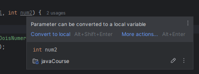

# Métodos parte 5 - Parâmetros do tipo primitivo
Se nós executarmos o código abaixo
```java
public class Calculadora {
    public void alteraDoisNumeros(int num1, int num2) {
        num1 = 99;
        num2 = 33;
        System.out.println("Dentro do alteraDoisNumeros");
        System.out.println("num1 " + num1);
        System.out.println("num2 " + num2);
    }
}
```
```java
import java_core.aula_048_OO_Metodos05ParametrosTipoPrimitivo.dominio.Calculadora;

public class CalculadoraTest04 {
    public static void main(String[] args) {
        Calculadora calculadora = new Calculadora();
        int num1 = 1;
        int num2 = 2;
        calculadora.alteraDoisNumeros(num1, num2);
        System.out.println(num1);
        System.out.println(num2);
    }
}
```
O que nos será impresso será
```text
num1 99
num2 33
1
2
```
e isso ocorre porque nós estamos fazendo um cópia dos valores que estão sendo passados


Os valores estão sendo criados e estão sendo passados para o nosso método, porém quando chega lá esses valores que
passamos estão sendo "subtituídos", e acaba-se criando uma cópia, tanto é que se passarmos o mouse em cima dos parâmetros,
irá falar que ele pode ser convertido para uma variável local


O que podemos aprender com isso é que dentro das nossas classes, quando estamos passando variáveis do tipo primitivo,
a variável original nunca será alterada, porque estamos passando uma cópia desses valores


