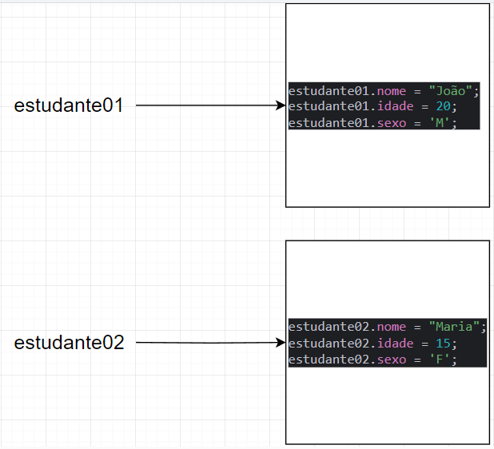

# Métodos parte 5 - Parâmetros do tipo referência
Na aula passado vimos os parâmetros do tipo primitivo, nesta aula veremos sobre passagem de parâmetros do tipo 
referência, onde a passagem dos tipos primitivos é bem mais simples que a passagem dos tipos de referência.

```java
public class Estudante {
    public String nome;
    public int idade;
    public char sexo;
}
```
```java
import java_core.aula_049_OO_Metodos06ParametrosTipoReferencia.dominio.Estudante;

public class ExecutaClasseEstudante {
    public static void main(String[] args) {
        Estudante estudante01 = new Estudante();
        Estudante estudante02 = new Estudante();

        estudante01.nome = "João";
        estudante01.idade = 20;
        estudante01.sexo = 'M';

        estudante02.nome = "Maria";
        estudante02.idade = 15;
        estudante02.sexo = 'F';

        System.out.println(estudante01.nome);
        System.out.println(estudante01.idade);
        System.out.println(estudante01.sexo);
        System.out.println("-----------------------");
        System.out.println(estudante02.nome);
        System.out.println(estudante02.idade);
        System.out.println(estudante02.sexo);
    }
}
```
```text
João
20
M
-----------------------
Maria
15
F
```
Com isso, nós temos 2 objetos em memória


## Imprimindo dados usando as variáveis de referência
Agora em vez de fazermos desse jeito, nós podemos fazer uma nova classe, responsável por imprimir os dados dos estudantes.
```java
public class ImprimeEstudante {
    public void imprime(Estudante estudante) {
        System.out.println("--------------------------");
        System.out.println(estudante.nome);
        System.out.println(estudante.idade);
        System.out.println(estudante.sexo);
    }
}
```
Agora nós voltamos a classe main, chamamos a classe ImprimeEstudante e imprimimos nossos dados novamente
```java
import java_core.aula_049_OO_Metodos06ParametrosTipoReferencia.dominio.Estudante;
import java_core.aula_049_OO_Metodos06ParametrosTipoReferencia.dominio.ImprimeEstudante;

public class ExecutaClasseEstudante {
    public static void main(String[] args) {
        Estudante estudante01 = new Estudante();
        Estudante estudante02 = new Estudante();
        ImprimeEstudante impressora = new ImprimeEstudante();

        estudante01.nome = "João";
        estudante01.idade = 20;
        estudante01.sexo = 'M';

        estudante02.nome = "Maria";
        estudante02.idade = 15;
        estudante02.sexo = 'F';

        impressora.imprime(estudante01);
        impressora.imprime(estudante02);
    }
}
```
```text
João
20
M
--------------------------
Maria
15
F
--------------------------
```
Quando nós passamos um objeto como argumento, nós na verdade estamos passando a referência dele na memória.

